<!-- ================================================================= -->
<!-- 🪐 COSMIC SPACE THEMED GITHUB PROFILE README 🪐 -->
<!-- ================================================================= -->

<div align="center">

  <!-- COSMIC COLLISION ANIMATED HEADER BANNER (SATURN X JUPITER) -->
  <a href="https://github.com/YOUR_GITHUB_USERNAME">
    
  </a>

  <br/><br/>

  <!-- DYNAMIC COSMIC TYPING HEADLINE -->
  <a href="https://git.io/typing-svg">
    
  </a>

  <p align="center">
    <a href="#-"></a>
    <a href="#-"></a>
    <a href="#-"></a>
  </p>

</div>

<p align="center">
  
</p>

<!-- ================= MISSION LOG TERMINAL ================= -->

### 🛰️ `MISSION LOG // CELESTIAL TELEMETRY`

<div align="center">
  
</div>

<p align="center">
  
</p>

<!-- ================= SKILL CONSTELLATIONS ================= -->

### 🌌 `STELLAR CONSTELLATIONS // TECH ARSENAL`

<table>
  <tr>
    <td width="50%" valign="top">
      <h4>🪐 Core Propulsion Languages</h4>
      <p>
        
        
        
        
        
        
      </p>
      <h4>✨ Galactic Frontend &amp; UI</h4>
      <p>
        
        
        
        
      </p>
    </td>
    <td width="50%" valign="top">
      <h4>☄️ Planetary Backend &amp; Engines</h4>
      <p>
        
        
        
        
        
      </p>
      <h4>🛰️ Nebula Cloud &amp; DevOps</h4>
      <p>
        
        
        
        
      </p>
    </td>
  </tr>
</table>

<p align="center">
  
</p>

<!-- ================= GALACTIC TELEMETRY STATS ================= -->

### 📊 `DEEP SPACE TELEMETRY // GITHUB METRICS`

<div align="center">

  <a href="https://github.com/anuraghazra/github-readme-stats">
    
  </a>
  <a href="https://github.com/DenverCoder1/github-readme-streak-stats">
    
  </a>

  <br/><br/>

  <a href="https://github.com/anuraghazra/github-readme-stats">
    
  </a>

</div>

<p align="center">
  
</p>

<!-- ================= FEATURED STARSHIPS (PROJECTS) ================= -->

### 🚀 `STAR SYSTEM EXPEDITIONS // FEATURED PROJECTS`

```rust
┌── [PROJECT-ALPHA] ─────────────────────────────────────────────────────────────┐
│ 🛸 GravityForge: High-concurrency distributed vector simulation engine         │
│ 🛠️ Rust • WebAssembly • WebGPU • Tokio                                         │
│ 🔗 https://github.com/YOUR_GITHUB_USERNAME/gravity-forge                       │
└────────────────────────────────────────────────────────────────────────────────┘

┌── [PROJECT-BETA] ──────────────────────────────────────────────────────────────┐
│ 🪐 Saturn-Ring-Lens: Real-time celestial trajectory & space physics dashboard  │
│ 🛠️ Next.js • Three.js • GLSL Shaders • TailwindCSS                            │
│ 🔗 https://github.com/YOUR_GITHUB_USERNAME/saturn-lens                         │
└────────────────────────────────────────────────────────────────────────────────┘
